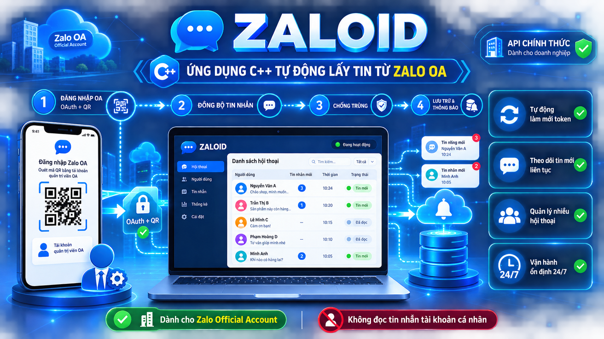

# zaloid

Ứng dụng C++17 tự động lấy tin nhắn từ **Zalo Official Account (OA)** qua Zalo Open API chính thức (`openapi.zalo.me`).

Ứng dụng poll định kỳ: lấy danh sách user đã tương tác với OA (`GET /v3.0/oa/user/getlist`), rồi lấy tối đa 10 tin nhắn gần nhất của từng user (`GET /v2.0/oa/conversation`), chống trùng theo `message_id`, in ra console và ghi vào file log.



*Sơ đồ luồng hoạt động: đăng nhập OA (OAuth v4 + PKCE, tự làm mới token) → poll danh sách user đã tương tác → lấy tin nhắn mới của từng user → chống trùng theo `message_id` → in ra console và ghi `zaloid.log`.*

## Yêu cầu

- CMake ≥ 3.14, trình biên dịch C++17
- libcurl (cài sẵn: `sudo apt install libcurl4-openssl-dev` trên Ubuntu/Debian)
- nlohmann/json tự tải qua FetchContent khi build lần đầu (cần mạng)

## Build

```bash
cmake -S . -B build
cmake --build build
```

## Lấy access token

Zalo **không có API cho tài khoản cá nhân** — bạn cần một Official Account:

1. Truy cập [developers.zalo.me](https://developers.zalo.me), đăng nhập bằng OA của bạn.
2. Tạo ứng dụng, lấy **OA Access Token** (hoặc Long-term Token) trong phần quản trị ứng dụng.
3. Các quyền cần thiết: quản lý tin nhắn/hội thoại của OA.

### Cách 1 — Token tĩnh

Dán token vào `config.json` (`access_token`) hoặc `export ZALO_ACCESS_TOKEN="..."`.

### Cách 2 — Đăng nhập OAuth v4 (tự động làm mới token)

Điền `app_id` + `secret_key` vào `config.json` (hoặc biến `ZALO_APP_ID`/`ZALO_SECRET_KEY`), rồi:

```bash
./build/zaloid login
```

Chương trình sinh `code_verifier`/`code_challenge` (PKCE, chuẩn RFC 7636) và mở server
callback tại `http://127.0.0.1:18080/callback`. Bạn làm theo hướng dẫn trên màn hình:
cấu hình callback URL + code_challenge trên developers.zalo.me, chọn quyền *Quản lý tin
nhắn người dùng*, mở đường dẫn cấp quyền và bấm "Cho phép". Token được lưu vào `tokens.json`
và tự động làm mới bằng refresh token mỗi khi gần hết hạn (25 giờ) khi chạy bình thường.

Lưu ý: refresh token hạn 3 tháng và chỉ dùng được một lần — mỗi lần refresh hệ thống phát
hành refresh token mới, app tự lưu đè; đừng tắt máy quá 3 tháng giữa hai lần chạy.

## Chạy

```bash
cp config.example.json config.json
# sửa access_token trong config.json, hoặc:
export ZALO_ACCESS_TOKEN="token_cua_ban"
./build/zaloid            # đọc config.json ở thư mục hiện tại
./build/zaloid /đường/dẫn/config.json   # hoặc chỉ định file config khác
./build/zaloid login      # đăng nhập OAuth (cần app_id + secret_key)
```

Nhấn **Ctrl+C** để dừng. Tin nhắn mới được ghi vào `zaloid.log`.

## Cấu hình

| Trường | Ý nghĩa | Mặc định |
|---|---|---|
| `access_token` | OA Access Token | bắt buộc |
| `poll_interval_sec` | Chu kỳ poll (giây) | 10 |
| `page_size` | Số mục mỗi trang (≤50) | 20 |
| `log_file` | File log tin nhắn | `zaloid.log` |
| `app_id` | ID ứng dụng OA (để dùng OAuth) | — |
| `secret_key` | Khóa bí mật ứng dụng (để dùng OAuth) | — |
| `tokens_file` | File lưu access/refresh token | `tokens.json` |
| `callback_port` | Cổng local nhận OAuth callback | `18080` |

Biến môi trường `ZALO_ACCESS_TOKEN` ưu tiên hơn giá trị trong file.

## Lưu ý pháp lý

Chỉ dùng Zalo Open API chính thức với token của chính bạn. Không dùng công cụ này để can thiệp tài khoản người khác — vi phạm điều khoản dịch vụ của Zalo.
